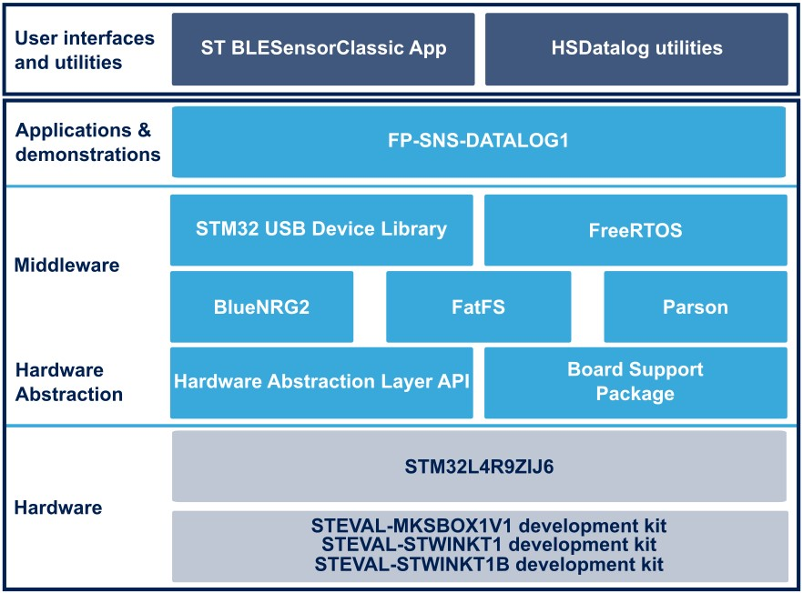

# FP-SNS-DATALOG1 Firmware Package

The **FP-SNS-DATALOG1** function pack including **High Speed Datalog** application for **STEVAL-MKSBOX1V1**, **STEVAL-STWINKT1** and 
**STEVAL-STWINKT1B** provides a comprehensive solution to save data from any combination of sensors and
microphones configured up to the maximum sampling rate.
 
The application also allows configuring LSM6DSOX (available in **SensorTile.box** example) and ISM330DHCX 
(available in **STWIN** example) **Machine Learning Core** unit and reading the output of the 
selected algorithm.

Sensor data can be stored onto a micro SD card (Secure Digital High Capacity - SDHC) formatted with the FAT32
file system, or streamed to a PC via USB (WinUSBclass) using the companion host software (cli_example) provided
for Windows and Linux.

The application can be controlled via Bluetooth using the [**STBLESensClassic app**](https://www.st.com/en/embedded-software/stblesensclassic.html)
which lets you manage the board and sensor configurations, start/stop data acquisition on SD card and control 
data labelling.

To read sensor data acquired using FP-SNS-DATALOG1, a few easy-to-use scripts in Python and Matlab are provided
within the software package. The scripts have been successfully tested with MATLAB v2019a and Python 3.10.

This firmware package includes Components Device Drivers, Board Support Package and example applications 
for the SensorTile.box platform (STEVAL-MKSBOX1V1) and for the STWIN development kit (STEVAL-STWINKT1B).

Here is the list of references to user documents:

- [DB4322](https://www.st.com/resource/en/user_manual/dm00743419.pdf) : STM32Cube High Speed Datalog function pack for STWIN evaluation kits
- [UM2688](https://www.st.com/resource/en/user_manual/dm00685314.pdf) : Getting started with the STM32Cube function pack for High Speed Datalog application with STWIN evaluation kits
- [STM32Cube](https://www.st.com/stm32cube) : STM32Cube

## Known Limitations

- None

## Development Toolchains and Compilers

-   IAR Embedded Workbench for ARM (EWARM) toolchain V9.20.1
-   RealView Microcontroller Development Kit (MDK-ARM) toolchain V5.37
-   STM32CubeIDE v1.12.0

## Supported Devices and Boards

- STEVAL-STWINKT1
- [STEVAL-STWINKT1B](https://www.st.com/stwin)
- [STEVAL-MKSBOX1V1](https://www.st.com/sensortilebox)

## Backward Compatibility

- None

## Dependencies

- None
